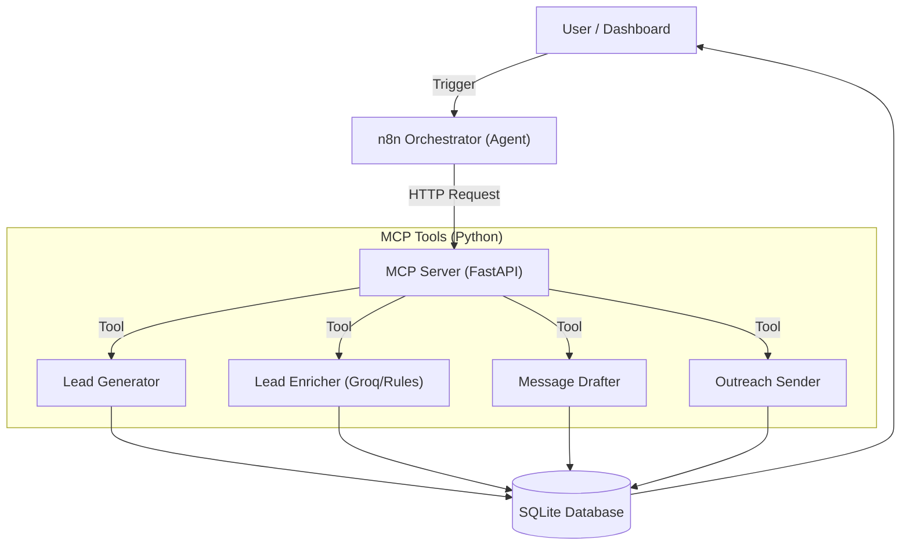

# 📌1.Introduction

# 🤖 Agentic Sales Bot: MCP-Powered Lead Gen & Outreach System

   

A full-stack, autonomous sales pipeline built to satisfy the **MCP-Powered Lead Gen + Outreach** take-home assignment. It uses the **Model Context Protocol (MCP)** to expose tools, **n8n** as the agentic orchestrator, and **Streamlit** for real-time monitoring.

---

### 📋 Assignment Compliance Matrix

| Requirement | Implementation Details | Status |
| :--- | :--- | :--- |
| **1. Lead Gen** | Python `Faker` library generates valid leads with realistic roles/industries. Reproducible via seed. | ✅ Done |
| **2. Enrichment** | Hybrid System: **Offline Mode** (Rules) & **AI Mode** (Groq Llama-3) for pain points & confidence scores. | ✅ Done |
| **3. Personalization** | Generates unique Cold Emails & LinkedIn DMs (A/B variations) referencing enriched data. | ✅ Done |
| **4. Sending** | Supports **Dry Run** (simulated) and **Live Run** (Mock SMTP server) with rate limits. | ✅ Done |
| **5. Frontend** | **Streamlit** dashboard showing funnel metrics, logs, and queue status. | ✅ Done |
| **6. Orchestration** | **n8n** workflow orchestrates the entire pipeline by calling MCP tools via API. | ✅ Done |
| **7. MCP** | **FastAPI** server exposes `generate_leads`, `enrich_leads`, etc., as standard tools. | ✅ Done |

---

## 🏗️ System Architecture

The system follows the required **Micro-Tool Architecture** where n8n acts as the "Brain" (Agent) and Python acts as the "Hands" (Tools).


---

# 📁 2.Project Structure

**The project follows a **clean micro-service architecture**, separating backend services, agent tools, automation workflows, and configuration.**

```
MCP-Powered Lead Gen+Enrichment+Outreach System/
│
├── app/                        # Main Application Source Code
│   ├── api.py                  # MCP Server (FastAPI) - The entry point
│   ├── dashboard.py            # Streamlit Frontend - The monitoring UI
│   ├── database.py             # SQLite Connection Manager
│   ├── generate_leads.py       # Tool: Generates dummy leads (Faker)
│   ├── enrich_leads.py         # Tool: Enriches leads (Groq LLM / Rules)
│   ├── generate_messages.py    # Tool: Drafts emails (LLM)
│   ├── send_messages.py        # Tool: Sends emails (SMTP)
│   └── mock_server.py          # SMTP Simulator for local testing
│
├── n8n/
│   └── pipeline_workflow.json  # n8n Workflow Export File
│
├── requirements.txt            # Python Dependencies
├── .env.example                # Configuration Example
└── README.md                   # Project Documentation
```
---

# 🧰 3.Tech Stack & Free Resources

Per assignment constraints, **zero paid tools** were used.

| Component      | Tool Used        | Why this choice? |
|---------------|------------------|------------------|
| Language      | Python 3.10+     | Standard for AI/Data Engineering. |
| Backend       | FastAPI          | High-performance, easy-to-create REST APIs. |
| Frontend      | Streamlit        | Rapid development of data monitoring dashboards. |
| Database      | SQLite           | Lightweight, serverless, and file-based (Zero config). |
| AI / LLM      | Groq             | **Free Tier**. Ultra-fast inference speed for Llama-3 models. |
| Orchestration | n8n (Docker)     | Visual workflow automation (Self-hosted / Free). |
| Testing       | Faker & Mock SMTP| To generate data and test emails safely locally. |

---

# ⚙️ 4.Installation & Setup

### Prerequisites

- Python 3.8+ installed  
- Docker Desktop installed (for n8n)

---

### Step 1: Clone the Repository

```bash
git clone https://github.com/ARISTOTILE-GIT/MCP-Powered-Lead-Gen-Enrichment-Outreach-System-.git
cd MCP-Powered-Lead-Gen-Enrichment-Outreach-System-
```

### Step 2: Install Dependencies

```bash
pip install -r requirements.txt
```

### Step 3: Setup Environment
**Create a .env file in the root directory and add your Groq API Key:**

```Ini,TOML
GROQ_API_KEY=gsk_your_actual_api_key_here
```
---

# ▶️ 5.How to Run the System

*To see the full pipeline in action, you need **3 terminal windows** running simultaneously.*

---

### Terminal 1: Mock SMTP Server

**Catches emails locally to ensure safe testing (Dry/Live modes).**

```bash
python app/mock_server.py
```
---
### Terminal 2: Backend MCP Server

**Exposes the tools (`generate`, `enrich`, `send`) via HTTP endpoints.**

```bash
python app/api.py
```
*Server starts at `http://localhost:8000`*

---
### Terminal 3: Frontend Dashboard

**Monitors the pipeline progress and logs.**

```bash
streamlit run app/dashboard.py
```
*Dashboard opens at `http://localhost:8501`*

---

# 🔄 6.Orchestration: n8n Workflow

The orchestration logic is handled by **n8n**, fulfilling the **"Agent"** requirement.

---

### 1. Start n8n (Docker)

```bash
docker run -it --rm --name n8n -p 5678:5678 --add-host=host.docker.internal:host-gateway n8nio/n8n:latest
```

### 2. Import Workflow:

* **Open `http://localhost:5678.`**

* *Click **"Add Workflow"** -> **"Import from File"**.*

* **Select `n8n/sales_pipeline_workflow.json` (included in this repo).**

### 3. Execute:
* **Click "Execute Workflow" to trigger the agentic loop.**

---

